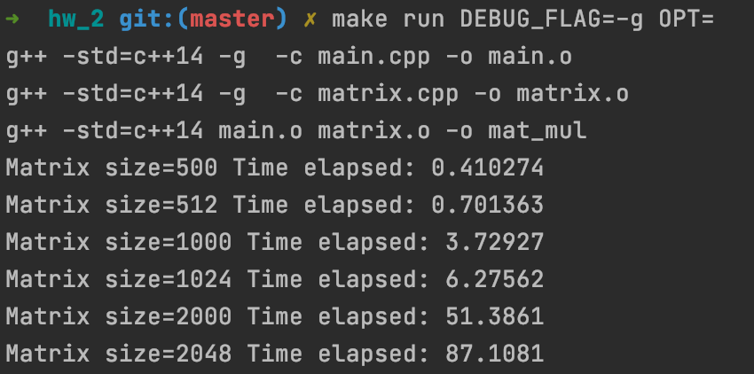
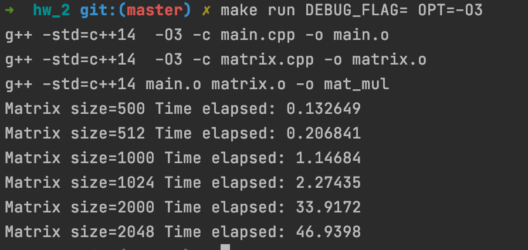

##Реализовать классическое перемножение матриц и умножение матрицы на вектор на C++
####Без оптимизации:

####С флагом оптимизации -O3:


##Базовые скрипты Bash
#### organize FOR loop printing the even numbers only from 100 to 1000
```
#!/bin/zsh

for i in `seq 10 2 1000`
do
echo $i
done
```
#### organize FOR loop printing the elements of array
```
#!/bin/zsh

MY_ARRAY=(this is test text with "two word" .)
for i in `seq ${#MY_ARRAY[@]}`
do
	echo ${MY_ARRAY[i]}
done
```
#### compute 100 + 0.5 in bash
```
#!/bin/zsh

a=100
b=0.5
ans=($a + $b)

echo $ans | bc
```
#### check if subdirectory ”Linux” exists in present directory. If yes, print message ”course”. If no, print message ”very easy” and create the ”Linux” directory.
```
#!/bin/zsh

DIR_NAME="Linux"

if [ -d $DIR_NAME ];

then
    echo "course"
else
    echo "very easy"
    mkdir $DIR_NAME
fi
```